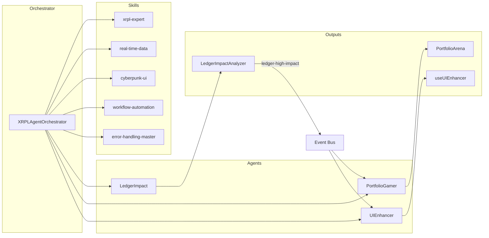

# 🎮 XRPL Control Room - Gamer UI

A cyberpunk-inspired **institutional-grade trading terminal** for monitoring the XRP Ledger ecosystem. Built with React 19, TypeScript, and Tailwind CSS.

**Florida-based, non-custodial XRPL dashboard – experimental. Educational/sim only. All execution via Xaman (user signs). No custody.**


## ✨ Features

### 📊 Terminal (NEW - Institutional Trading)
- **Real-Time Price Feeds** - WebSocket connection to Binance for live BTC, ETH, XRP, SOL, DOGE prices
- **Liquidation Heatmap** - Visualize leveraged position liquidation zones with risk scoring
- **Order Book Depth** - Live bid/ask ladders with spread analysis and imbalance detection
- **Advanced Risk Metrics** - VaR (95%/99%), CVaR, Sharpe, Sortino, Calmar ratios
- **Position Sizing Tools** - Kelly Criterion, Fixed Fractional, Volatility-Adjusted, Risk Parity
- **Stress Testing** - Predefined scenarios (Black Monday, COVID crash, Flash crash, Rate hike)
- **Multi-Channel Alerts** - Telegram, Discord, browser push notifications
- **Paper Trading** - Risk-free practice with 24 crypto pairs and auto-trader bot

### 🧠 Memetic Lab
- **Game Theory Scenarios** - Prisoner's Dilemma, Stag Hunt, Pump & Dump detection
- **Cognitive Security** - Defense against narrative warfare, FUD, Sybil attacks
- **Social Engineering Simulator** - Test your defenses against manipulation tactics
- **AI Quantum Analytics** - Nash equilibrium analysis, memetic propagation models
- **Prediction Markets** - Polymarket/Kalshi integration with signal fusion
- **Whale Tracking** - Monitor large transactions and whale wallet activity

### 🏠 Home Dashboard
- **Digital Profile Panel** - Avatar, reputation, social score, skill points
- **Drag & Drop Simulation** - Interactive DEX, AMM, and VOTE nodes
- **Ledger Impact Tool** - Risk analysis and real-time metrics
- **Xaman Wallet Integration** - QR code connection
- **Live Feeds** - Twitter/X and GitHub activity streams

### 🗺️ Network (World Map + Topology)
- **Interactive World Map** - Global XRPL network with five lenses: Validators, ILP, Corridors, Community, Regulation
- **Ledger Topology** - ILP network graph: ledgers, connectors, trust-based corridors; Trust/Domain/Flow lenses; TRUST & DOMAIN legend
- **Full Network Topology** - Single graph aggregating validators, ILP ledgers, payment corridors, ODL partners, bridges & chains; layer toggles; **full-screen view** (click graph or button to expand)
- **Payment Corridors Ecosystem** - ODL partners, payment corridors with sourced monthly volume & YoY, cross-chain bridges, XRPL-connected chains
- **Node Hotspots** - Validator locations and health metrics; live XRPScan data toggle
- **Regional Analytics** - TPS charts and distribution stats

### 💀 Underworld
- **Regulatory Intelligence** - Real-time tracking of crypto regulations
- **Risk Radar** - Compliance metrics by jurisdiction
- **SEC/CFTC Monitoring** - GENIUS Act, EO 14178 summaries
- **Alert Ticker** - Breaking regulatory news

### 👤 Character
- **XP & Leveling System** - Gamified progression
- **Achievement Badges** - Unlock rewards for milestones
- **Leaderboard** - Top XRPL contributors
- **Community Events** - Calendar integration

### 🏥 Clinic
- **Portfolio Diagnostics** - Health scoring and recommendations
- **Stablecoin Metrics** - RLUSD tracking
- **ETF Analysis** - Inflow/outflow monitoring
- **Resource Library** - SDKs, documentation, tutorials

## 🛠️ Tech Stack

| Category | Technology |
|----------|------------|
| **Framework** | React 19 + TypeScript 5 |
| **Build Tool** | Vite 5.4 |
| **Styling** | Tailwind CSS 3 |
| **Routing** | React Router DOM 7 |
| **Animations** | Framer Motion |
| **Charts** | Recharts |
| **State** | Zustand |
| **Data Fetching** | TanStack Query (React Query) |
| **Real-Time Data** | WebSockets (Binance, XRPL) |
| **Icons** | Lucide React |
| **AI Agents** | XRPLAgentOrchestrator, skills (xrpl-expert, cyberpunk-ui, etc.) |
| **3D** | Three.js (Portfolio Arena) |
| **Blockchain** | xrpl.js (testnet) |

## 🤖 AI Agents Guide

The app includes a **Mega AI Agent** layer: a central `XRPLAgentOrchestrator` that loads 3–5 skills per invocation and routes tasks to specialized agents. Testnet only; no mainnet spends.

### Architecture (Mermaid)



### Skill invocation examples

| Skill | Use case |
|-------|----------|
| `@xrpl-expert` | Amendment analysis, ledger events, testnet client |
| `@real-time-data` | Live amendments, WebSocket subscription |
| `@cyberpunk-ui` | Neon impact score, glitch hologram warning |
| `@workflow-automation` | High impact → Discord alert + UI popup |
| `@error-handling-master` | Offline cache, retry on WebSocket fail |
| `@three-js` | Portfolio Arena 3D (NFTs as neon fighters) |
| `@performance-optimizer` | Debounce fetches (1s), virtualize lists |

### Make the AI functional (real API)

The orchestrator calls a **real AI API** when configured. Without it, a rule-based fallback uses amendment data (no mock).

Create a `.env` in the project root (or set in your host):

```env
VITE_AI_API_URL=https://your-ai-proxy.com/v1/chat
VITE_AI_API_KEY=your-api-key-if-required
```

- **Request:** POST with `{ "prompt": "..." }`. The prompt includes system + user message.
- **Response:** Either your API returns `{ "analysis", "codeSuggestions", "uiUpdates", "neonImpactScore" }`, or OpenAI/Anthropic-style `choices[].message.content` / `content[].text` containing that JSON.
- If the API is missing or fails, the app uses a **rule-based fallback** (impact score from amendment support %) so everything still works.

### Run with agents (hot-reload)

```bash
npm run dev:agents
```

### Sample agent invocation (console)

```ts
import { getDefaultOrchestrator } from './agents/Orchestrator';

const orch = getDefaultOrchestrator();
const result = await orch.invokeAgent(
  'Simulate amendment raid: Predict TPS fallout.',
  { amendments: [{ name: 'AMM', percentSupport: 95 }] },
  'ledger'
);
console.log(result.neonImpactScore, result.analysis);
```

### Next steps

To expand, add a `@security-auditor` skill for XRPL vulnerability scans, or wire a real AI backend in `Orchestrator.callAI()` (e.g. `fetch('/api/ai', { body: prompt })`). To **train or improve agents**, see [docs/AGENT-HUB-TRAINING.md](./docs/AGENT-HUB-TRAINING.md) and [docs/AGENT-HUB-REFERENCES.md](./docs/AGENT-HUB-REFERENCES.md) (FinRL, OpenBB, MARL, Langflow, and a Cursor prompt template).

## 🚀 Getting Started

### Prerequisites
- Node.js 18+ 
- npm or yarn

### Installation

```bash
# Clone the repository
git clone https://github.com/Shellfish011235/xrpl-control-room-gamer-ui.git

# Navigate to project directory
cd xrpl-control-room-gamer-ui

# Install dependencies
npm install

# Start development server
npm run dev
```

The app will be available at `http://localhost:3000`

### Build for Production

```bash
npm run build
```

## 📁 Project Structure

```
xrpl-control-room-gamer-ui/
├── src/
│   ├── components/
│   │   ├── institutional/        # Trading terminal components
│   │   ├── globe/                 # WorldGlobe map
│   │   ├── ilp/                   # ConnectorMap, ledger topology
│   │   ├── network/               # Full network topology (unified graph, full-screen)
│   │   ├── Navigation.tsx
│   │   ├── PaperTradingPanel.tsx
│   │   └── WalletConnect.tsx
│   ├── data/
│   │   ├── corridorData.ts        # Payment corridors, ODL partners, bridges, chains
│   │   ├── unifiedTopology.ts     # Aggregated topology for full network graph
│   │   ├── globeContent.ts
│   │   ├── ilpData.ts
│   │   └── regulatoryData.ts
│   ├── pages/
│   │   ├── Home.tsx
│   │   ├── Network.tsx            # Map + Ledger topology + Full network topology
│   │   ├── Terminal.tsx
│   │   ├── MemeticLab.tsx
│   │   ├── Underworld.tsx
│   │   ├── Character.tsx
│   │   └── Clinic.tsx
│   ├── services/
│   │   ├── ilp/                   # ILP topology (ledgers, connectors, corridors)
│   │   ├── websocketPriceFeeds.ts
│   │   ├── liquidationHeatmap.ts
│   │   └── xrplService.ts
│   ├── store/
│   │   ├── ilpStore.ts            # Ledger/topology state
│   │   ├── globeStore.ts
│   │   └── paperTradingStore.ts
│   ├── App.tsx
│   ├── main.tsx
│   └── index.css
├── COMPLIANCE-GLOBAL-US-FLORIDA.md  # Compliance overview (not legal advice)
├── PRODUCTION-SAME-AS-LOCAL.md      # Env parity for Vercel/local
├── SAFETY-AUDIT.md                  # Security & safety notes
├── COMPETITIVE-ANALYSIS.md
├── INSTITUTIONAL-UPGRADE-PLAN.md
└── package.json
```

## 🎨 Design Philosophy

This dashboard features a **cyberpunk/gaming aesthetic** inspired by:
- Sci-fi HUD interfaces
- Neon color palettes (cyan, purple, green accents)
- Glowing borders and animated grids
- Dark theme with high contrast elements
- Smooth micro-interactions and transitions

### Color Palette
| Color | Hex | Usage |
|-------|-----|-------|
| Cyber Glow | `#00d4ff` | Primary accent, highlights |
| Cyber Purple | `#a855f7` | Secondary accent |
| Cyber Green | `#00ff88` | Success states, profits |
| Cyber Yellow | `#ffd700` | Warnings, achievements |
| Cyber Red | `#ff4444` | Errors, alerts, losses |
| Cyber Dark | `#0a0f1a` | Background |

## 🔌 API Integrations

| Service | Purpose | Status |
|---------|---------|--------|
| **XRPL WebSocket** | Ledger index, live feed | ✅ Live |
| **CoinGecko** | XRP price in nav bar | ✅ Live |
| **Binance WebSocket** | Real-time orderbook, trades | ✅ Live (Terminal) |
| **XRPL Pathfinding** | Payment routing (ripple_path_find) | ✅ Live |
| **World Globe** | 2D map, Network lenses | ✅ Live |
| **ILP Topology** | Ledgers, connectors, corridors (in-app) | ✅ Live |
| **Full Network Topology** | Unified graph, full-screen | ✅ Live |
| **CoinGlass** | Liquidation data | 🔧 Ready for API key |
| **CoinGlass XRP ETF** | ETF flow history, 24h net flow (Profile → Portfolio) | 🔧 Set `VITE_COINGLASS_API_KEY` |
| **Telegram Bot API** | Alert notifications | 🔧 Ready for token |
| **Discord Webhooks** | Alert notifications | 🔧 Ready for webhook URL |

## 🌐 Deployment

### Vercel (Recommended) — Phase 1 demo
Deploy the current app so others can try **Run the Orchestra** (Micropayments → AI Agents) and **Paper Trading** with the **Orchestra suggestion** (Price + Sentiment → rule-based). No real funds; see [ROADMAP.md](./ROADMAP.md) Phase 1.

```bash
npm i -g vercel
vercel
```

### Netlify
```bash
npm run build
# Deploy the `dist` folder
```

### Docker
```bash
docker build -t xrpl-control-room .
docker run -p 3000:3000 xrpl-control-room
```

## 🤖 Cline CLI (AI code review)

This repo is set up for [Cline CLI](https://cline.bot/cli) so you can run AI-assisted review and automation from the terminal (and in CI), with lower API bottleneck by using multiple providers or local models.

### Setup (local)
```bash
npm install -g cline
cline auth
```
Use Node 20+ and your preferred provider (Anthropic, OpenAI, Ollama, etc.).

### Project rules
Cline reads **`.clinerules/`** in this repo for project context:
- **01-stack-and-structure.md** – React 19, TypeScript, Vite, Tailwind, Zustand, paths.
- **02-xrpl-and-payments.md** – XRPL (drops, addresses), Xaman, payment channels, agent panel.
- **03-conventions.md** – Code style, imports, errors, a11y.

### NPM scripts
| Script | Description |
|--------|-------------|
| `npm run cline:review` | Review **unstaged** diff (requires `cline` on PATH). |
| `npm run cline:review-staged` | Review **staged** changes. |
| `npm run cline:deps` | Ask Cline to check `package.json` for CVEs/outdated deps. |

### CI (optional)
The workflow **`.github/workflows/cline-review.yml`** runs on pull requests and pipes the PR diff to Cline in autonomous mode (`-y`). To enable it, add one of these as a repository secret: `ANTHROPIC_API_KEY`, `OPENAI_API_KEY`, or `CLINE_API_KEY`. If no secret is set, the step is skipped without failing the PR.

## 🗺️ Roadmap

**Phased strategy:** Prototypes and community feedback first; see **[ROADMAP.md](./ROADMAP.md)** for the full plan (simulations → testnet → compliant APIs → funding → document & audit). **Regulatory watch:** [REGULATORY-WATCH.md](./REGULATORY-WATCH.md).

### Shipped
- [x] **NFT Arena (Phase 1)** – `/nfts`: XLS-20 gallery, mint (Xaman), portfolio, trade (BETA)
- [x] **Cross-Chain Nexus** – `/bridges`: Bridge flows XRPL ↔ EVM/Solana (BETA)
- [x] **Agent Hub (Phase 8)** – `/agents`: OpenClaw-style dashboard, Wake/heartbeat (30s), persistent memory, 3 skills (path, NFT, bridge)
- [x] **Phase 0** – Global disclaimer banner, Testnet/Mainnet toggle (red mainnet warning), Premium placeholder, README compliance line
- [x] **Liquidity Path Optimizer (Phase 1)** – `/optimizer`: Liquidity Nexus, ranked paths (XRPL + AMM + bridge), cost/speed/risk, Recharts, favorites
- [x] Real-time WebSocket price feeds (Terminal)
- [x] Liquidation heatmap visualization (Terminal)
- [x] Advanced risk metrics (VaR, Sharpe, etc.)
- [x] Multi-channel alert system
- [x] Paper trading simulator
- [x] Game theory & cognitive security lab
- [x] Network page: World Map with Validators / ILP / Corridors / Community / Regulation lenses
- [x] Ledger topology: ILP network graph with trust-based corridors and domain lens
- [x] Full network topology: unified graph (validators, ILP, ODL, bridges & chains) with full-screen view
- [x] Payment corridors ecosystem: sourced volume data, ODL partners, bridges & chains
- [x] XRPL Pathfinding with live mainnet connection
- [x] Compliance and safety docs (COMPLIANCE-GLOBAL-US-FLORIDA, SAFETY-AUDIT, PRODUCTION-SAME-AS-LOCAL)

### Next (phased, zero/low risk first)
- [ ] **Phase 1:** AI-driven paper trading + mock agents (Zustand/TanStack Query sims, Kelly Criterion); backtesting engine
- [ ] **Phase 2:** XRPL Testnet branch — supervised agents (Xaman QR), mock AML in Underworld
- [ ] **Phase 3:** Compliant programmatic tools (Ripple WaaS/policy mocks, trust layers)
- [ ] **Phase 4:** XRPL Grants AI Fund (Spring 2026), accelerator, community feedback
- [ ] **Phase 5:** AI risk docs, explainability, audit logging (ongoing)
- [ ] Advanced order types (TWAP, iceberg)
- [ ] REST API for external integrations
- [ ] PostgreSQL/TimescaleDB for tick data
- [ ] Mobile responsive optimization

## 🤝 Contributing

Contributions are welcome! Please feel free to submit a Pull Request.

1. Fork the repository
2. Create your feature branch (`git checkout -b feature/AmazingFeature`)
3. Commit your changes (`git commit -m 'Add some AmazingFeature'`)
4. Push to the branch (`git push origin feature/AmazingFeature`)
5. Open a Pull Request

## 📄 License

**Software:** [MIT License](LICENSE) – feel free to use this project for your own purposes. **Non-custodial:** Users control their own funds and keys; this project does not provide financial, investment, or money transmission services.

**Operating / monetizing:** You are responsible for having any required **regulatory or business licenses** (e.g. money transmission, securities, subscriptions) in place before offering paid tiers or fee flows. See **[docs/LICENSES-AND-COMPLIANCE.md](docs/LICENSES-AND-COMPLIANCE.md)** and [docs/FLORIDA-NOT-MONEY-TRANSMITTER.md](docs/FLORIDA-NOT-MONEY-TRANSMITTER.md). Not legal advice.

## 🔗 Links

- [XRPL Documentation](https://xrpl.org)
- [Ripple Developer Portal](https://ripple.com/build)
- [XRP Ledger Foundation](https://foundation.xrpl.org)
- [CoinGecko API](https://www.coingecko.com/en/api)
- [Binance WebSocket API](https://binance-docs.github.io/apidocs/spot/en/#websocket-market-streams)

---

Built with 💙 for the XRPL Community
